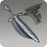
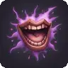
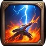
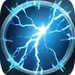
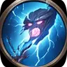
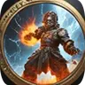
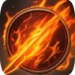

# Barbarian Class Guide

The Barbarian is a Strength/Constitution-based melee class built around Rage. While raging they hit harder, resist physical damage, and can layer elemental damage through Storm Herald abilities. They have strong survivability tools and snowball significantly in the late game.

---

## Level Features

These are automatically granted at the listed level.

| Level | Icon | Feature |
|-------|------|---------|
| 1 |  | Rage |
| 2 |   | Reckless Attack + Always Ready |
| 5 |  | Extra Attack |
| 7 |  | Primal Instinct |
| 9 |  | Enhanced Critical |
| 11 |  | Death Warding Rage |
| 18 |  | Indomitable Might |
| 20 |  | Unrivaled Ability |

###  Rage *(L1 — No energy, self-target)*
Enter a barbarian rage for **10 turns**, gaining:
- **+2 bonus damage** on all attacks
- **Resistance to bludgeoning, piercing, and slashing damage**
- **Advantage on Strength checks and saving throws**

###  Reckless Attack *(L2 — Melee)*
Attack with abandon. Gain advantage on melee attack rolls this turn but **grant advantage to all attackers against you** until your next turn. Deals weapon damage + Strength modifier.

###  Always Ready *(L2 — Passive)*
Permanent **advantage on Dexterity saving throws** against traps, spells, and visible effects.

###  Extra Attack *(L5)*
Passive. Grants **1 extra attack** per turn.

###  Primal Instinct *(L7 — Passive)*
Permanent **advantage on initiative rolls**. You almost always act first.

###  Enhanced Critical *(L9 — Passive)*
Critical strikes deal extra damage dice:
- Levels 9–12: **+1 extra damage die**
- Levels 13–16: **+2 extra damage dice**
- Level 17+: **+3 extra damage dice**

###  Death Warding Rage *(L11 — Passive)*
Once per rage, when you would drop to 0 HP, you drop to **1 HP instead** (requires at least 1 HP remaining).

###  Indomitable Might *(L18 — Passive)*
When making a Strength check, you may use your **Strength score itself** instead of the dice roll if it's higher.

###  Unrivaled Ability *(L20 — Passive)*
Permanently increases **Strength and Constitution by 4**, with an ability score cap of 24.

---

## Level Options

###  Taunt *(L2+, No energy)*
Challenge all enemies, forcing them to target you for **3 turns**. Use this to protect squishier allies or to set up defensive plays while raging.

---

## Storm Herald — Affinity Options *(L6+, Affinity-Gated)*

Unlocked at level 6 if you have the matching affinity. Active only **while raging**.

| Affinity | Icon | Ability | Effect |
|----------|------|---------|--------|
| Heavenfire |  | Storm Melee: Heat | Melee attacks deal extra **1d6 heat** damage (2d6 at L14+). |
| Lust |  | Storm Melee: Cold | Melee attacks deal extra **1d6 cold** damage (2d6 at L14+) and may **Slow** target (Con save). |
| Chaos |  | Storm Melee: Poison | Melee attacks deal extra **1d6 poison** damage (2d6 at L14+) and may **Poison** target (Con save). |

---

## Storm Herald — Aura Options *(L14+, Affinity-Gated)*

Unlocked at level 14 if you have the matching affinity. Active only **while raging**.

| Affinity | Icon | Ability | Effect |
|----------|------|---------|--------|
| Heavenfire |  | Storm Aura: Heat | Enemies with highest initiative take **1d6 heat** damage per turn (2d6 at L17+); all allies gain heat resistance. |
| Lust |  | Storm Aura: Cold | Enemies with highest initiative take **1d6 cold** damage per turn (2d6 at L17+), may Slow; all allies gain cold resistance. |
| Chaos |  | Storm Aura: Poison | Enemies with highest initiative take **1d6 poison** damage per turn (2d6 at L17+), may Poison; all allies gain poison resistance. |

---

## Storm Herald Feats *(Feat Levels 4, 8, 12, 16)*

Barbarian-specific feats available at feat levels, in addition to generic feats.

| Level | Icon | Feat | Description |
|-------|------|------|-------------|
| L4 |    | Storm Herald Melee | Affinity-gated. Scales 1d6 → 2d6 → 3d6 → 4d6 at levels 8, 12, 16. |
| L8 |    | Storm Herald Aura | Affinity-gated. Scales 1d6 → 2d6 → 3d6 at levels 12, 16. |
| L12/L16 | — | Re-offer | Any Storm Herald feat not yet taken is offered again. |

The Storm Herald Feat versions scale higher than the standard level options above — if you can take them via feats, they're stronger.

---

## Tips

- **Rage before you attack.** Most of your offensive and defensive bonuses require you to be raging. Make Rage your first action.
- **Reckless Attack** is high-risk, high-reward. Use it when you have Death Warding Rage (L11) active or when you need to eliminate a target fast.
- **Taunt + Rage** is a strong combo — you draw all attacks while also resisting physical damage. Very effective for protecting party members.
- **Primal Instinct** (L7) nearly guarantees you act first. Use this to pop Rage before enemies can act.
- **Storm Herald Melee** is your primary source of elemental damage. The Chaos (poison) and Lust (cold/slow) variants add crowd control on top of damage.
- **Storm Aura** (L14+) passively damages the most dangerous enemies every turn while raging — it rewards staying in melee and prolonging fights.
- **Unrivaled Ability** (L20) caps at +4 Str/Con. Combined with the Storm Herald scaling, late-game Barbarians hit extremely hard with every swing.
- Unlike Fighters, Barbarians have more survivability tools (Death Warding Rage, passive damage resistance). You can afford to play more aggressively.
