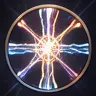

# Cleric Class Guide

The Cleric is a Wisdom-based divine caster focused on healing, radiation damage, and sustain. They excel in longer fights where their passive regeneration and party healing can turn the tide.

---

## Level Features

These are automatically granted at the listed level.

| Level | Icon | Feature |
|-------|------|---------|
| 1 |  | Heal |
| 2 |  | Divine Grace |
| 3 |  | Channel Divinity |
| 5 |  | Sacred Aura |
| 7 |  | Divine Ward |
| 9 |  | Blessed Resilience |
| 11 |  | Holy Aura |
| 14 |  | Extra Attack |
| 18 |  | Divine Ascension |
| 20 |  | Avatar of Light |

###  Heal *(L1 — Auto)*
A baseline healing ability granted at level 1.

###  Divine Grace *(L2)*
Passive. Adds your **Wisdom modifier** to all saving throws.

###  Channel Divinity *(L3 — 5 Heavenfire energy, once per rest)*
Heal all allies for **2d8 + Wisdom modifier** HP, and deal **2d8 radiation damage** to all enemies simultaneously. Resets on rest.

###  Sacred Aura *(L5)*
Passive. Regenerates **1d4 HP per turn**.

###  Divine Ward *(L7)*
Passive. Grants permanent **resistance to radiation damage**.

###  Blessed Resilience *(L9)*
Passive. Regenerates **1d6 HP per turn** (stacks with Sacred Aura for up to 1d4+1d6 per turn).

###  Holy Aura *(L11)*
Passive. Grants **+2 to spell saving throws** and **+2 Wisdom**.

###  Extra Attack *(L14)*
Passive. Grants one additional attack per turn.

###  Divine Ascension *(L18)*
Passive. Permanently increases **Wisdom by 4**, with an ability score cap of 24.

###  Avatar of Light *(L20)*
Passive. Reduces all spell costs by **25%** and adds your **Wisdom modifier as bonus radiation damage** to all spells.

---

## Spells (Level Options)

Spells are chosen on level up and added to your action list.

### Level 1
| Icon | Spell | Energy | Description |
|------|-------|--------|-------------|
|  | Aid | — | Support/healing ability for allies. |
|  | Firebolt | — | Standard fire damage spell. |
|  | Divine Bitch Slap | — | Divine melee strike. |
|  | Holy Rage Action | — | Affinity-based divine rage ability. |

### Level 2
| Icon | Spell | Energy | Description |
|------|-------|--------|-------------|
|  | Sacred Flame | 3 (Heavenfire) | Calls down sacred flame on a target. Deals **Nd8 + Wisdom modifier** radiation damage (N scales as `1 + level/3`). Dexterity save for half. |

### Level 3
| Icon | Spell | Energy | Description |
|------|-------|--------|-------------|
|  | Divine Smite | — | Powerful melee strike with divine damage. |
|  | Lust Blessing *(Lust affinity)* | — | Affinity-based lust spell. |

### Level 5
| Icon | Spell | Energy | Description |
|------|-------|--------|-------------|
|  | Fireball | — | Large area fire damage. |
|  | Greater Heal | — | A more powerful healing spell. |
|  | Blessed Strike | 2 (Heavenfire) | Melee weapon hit + self-heal for **1d6 + Wisdom modifier**. |

### Level 7
| Icon | Spell | Energy | Description |
|------|-------|--------|-------------|
|  | Holy Word | 6 (Heavenfire) | All enemies take **Nd8 + Wisdom modifier** radiation damage (N scales as `2 + level/5`). Enemies who fail a Wisdom save are **Stunned for 1 turn**. |

### Level 9
| Icon | Spell | Energy | Description |
|------|-------|--------|-------------|
|  | Mass Heal | — | Heals all allies. |

---

## Affinity Spell Options *(L6+ — Affinity-Gated)*

| Affinity | Icon | Spell | Description |
|----------|------|-------|-------------|
| Heavenfire |  | Sacred Temptation | Divine temptation spell. |
| Lust |  | Lust Blessing | Lust-based blessing ability. |
| Chaos |  | Chaos Rage Action | Chaos-infused rage ability. |

---

## Feat Levels

Generic feats are available at levels **4, 8, 12, and 16**.

---

## Tips

- **Wisdom is your primary stat.** It drives Divine Grace (saving throws), Sacred Flame damage, Blessed Strike heals, Holy Word damage, and Avatar of Light. Stack it.
- **Sacred Aura + Blessed Resilience** stack, giving up to **1d4 + 1d6 HP regen per turn** by level 9 — you become very hard to kill in extended fights.
- **Channel Divinity** is a swing ability: heals your whole party while damaging all enemies at once. Use it when the fight is balanced — it can flip the momentum entirely.
- **Holy Word** (L7) is your best crowd-control nuke. It hits every enemy and has a stun chance. Use it when you need to buy a turn.
- **Avatar of Light** (L20) combined with high Wisdom turns all your radiation spells into massive damage. Prioritize Wisdom investment heading into late game.
- The Cleric rewards a patient, reactive playstyle — let passive regen work for you and save high-cost spells like Channel Divinity and Holy Word for pivotal moments.
