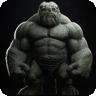

# Darklord Class Guide

**Version:** 0.4

The Darklord is a chaos-aligned dark spellcaster who bends demons and beasts to their will. Alongside a small kit of control and self-sustain abilities, the Darklord's signature is **summoning**: conjuring creatures that fight at your side.

---

## Level Features

Automatically granted at the listed level.

| Level | Feature | Notes |
|-------|---------|-------|
| 1 | Absorb Pain | Self-sustain / damage mitigation. |
| 2 | Seduce, Command | Control abilities (Seduce from the Lust kit, Command debuff). |
| 5 | Extra Attack | An additional attack action per turn. |
| — | Chaos Rage | Granted only when multiclassed with Barbarian. |

---

## Spell Options (Level Choices)

Chosen on level up and added to your action list.

| Icon | Ability | Level | Energy | Description |
|------|---------|-------|--------|-------------|
|  | Heat | 2 | 2 | Kindles magical warmth in a target. Constitution save or become **Hot**: 1d5 heat damage/turn for 5 turns. |
| — | Black Hole | 14 | — | Tri-affinity capstone (requires all three affinities). |

---

## Summoning

Summons conjure a creature onto **your** side of the battle. The creature is
**player-controlled** — you pick its action each turn, like a temporary party
member — and it fights until it is slain or the battle ends. **Only one summon
can be active at a time**: conjuring a new one dissolves the previous.

Each tier meaningfully out-scales the last, and every creature's hit points and
damage scale with the Darklord's level.

| Icon | Summon | Level | Energy | Creature | Attacks |
|------|--------|-------|--------|----------|---------|
|  | Summon Raven | 2 | 2 | **Raven** — fragile, fast familiar (high initiative, low HP). | Raking Peck (1d4 physical). |
|  | Summon Lesser Demon | 5 | 3 | **Lesser Demon** — a clawed melee brute. | Demonic Claws (1d8 physical). |
|  | Summon Demon Elite | 9 | 5 | **Demon Elite** — durable and versatile. | Savage Rend (2d6 physical) + Infernal Bolt (2d6 heat). |
|  | Summon Behemoth | 13 | 7 | **Behemoth** — enormous HP, a slow wall of muscle. | Crushing Slam (2d10 physical). |
|  | Summon Hellhound | 13 | 6 | **Hellhound** — the fire-specialist capstone. | Searing Bite (2d8 heat) + Hellfire Breath (2d6 heat, applies **Hot**). |

The two level-13 summons are parallel picks: choose the **Behemoth** for a
physical bruiser, or the **Hellhound** for a fire build (its Hellfire Breath
leaves enemies burning with the Hot condition).

### Notes

- Summons are **combat-scoped**: they never join your permanent party and do
  not persist between fights.
- All summon abilities cost energy from **any** affinity pool, so any Darklord
  build can cast them.
- Natural attacks add the creature's Strength modifier and double their dice on
  a critical hit, just like a weapon strike.

---

## Tips

- **Front-load your summon.** Because it fights until it dies, casting it early
  maximizes the number of turns it acts. A summoned creature is effectively a
  second body soaking hits and dealing damage every round.
- **The Hellhound pairs with heat synergies.** Its Hot condition stacks
  chip damage on top of other fire effects.
- **The Behemoth is a bodyguard.** Its huge HP pool draws enemy attacks away
  from your squishier party members.
