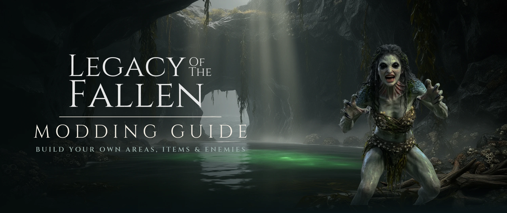

# Modding Guide



Legacy of the Fallen ships a small **mod framework** that lets you add content —
items, enemies, whole new areas — **without editing a single existing game
file**. This keeps mods self-contained, easy to distribute, and safe against
game updates.

This guide walks through the architecture and the complete example mod that
ships in `game/mods/example_mod/`.

---

## 1. How mods load

Ren'Py automatically compiles **every `.rpy` file anywhere under `game/`**,
including subfolders. That's the whole loading mechanism — there is no manifest
and nothing to register a mod with. Drop a folder under `game/mods/` and its
scripts are compiled and run at launch alongside the core game.

```
game/
  mods/
    _mod_framework.rpy      <- the extension layer (ships with the game)
    example_mod/
      example_mod.rpy       <- a complete example mod
    your_mod/
      your_mod.rpy          <- your content goes here
```

Because mods share the one global namespace with the core game, follow two
rules to stay collision-free:

- **Prefix your names.** Labels, `image` names, `default` variables, Python
  classes and functions all live in one namespace. Prefix everything with your
  mod's name (`yourmod_...`).
- **Use `default`, not `define` or bare assignment, for anything that must
  persist in a save** (area state, "cleared" flags, unlocked toggles). Plain
  store variables — and especially names starting with `_` — are **not saved**.

### Load order

The framework's registration functions must exist before your mod calls them.
The framework runs its setup at `init -10`; register your content at the
default `init` phase or later (`init python:` / `init 1 python:`). Lower init
numbers run first.

---

## 2. The extension hooks

Everything is driven by three functions defined in `_mod_framework.rpy`. Call
them from an `init python` block in your mod.

| Function | Purpose |
|---|---|
| `register_mod(mod_id, display_name=None, enabled_by_default=True, version=None)` | Declares your mod to the **Mod Manager** (see below), sets whether it ships enabled, and supplies the version string the manager displays. Call once at init. |
| `register_mod_area(name, entry_label, icon=…, tooltip=…)` | Adds a travel node to the floating **Mods** portal that appears on world maps. |
| `register_mod_vendor_stock(vendor_id, item_factory, max_stock=1)` | Injects an item into an **existing** vendor's inventory (e.g. Thalassa) with no edit to that vendor. |
| `register_mod_vendor(vendor_id, setup_label, vendor_var_name)` | Teaches the framework about a vendor it doesn't already know, so you can inject stock into it. |

### The Mod Manager

The framework adds a **Mods** item to the main menu that opens a manager listing
every installed mod (auto-discovered from the folders under `game/mods/`) with an
on/off toggle. State is stored in `persistent.mod_enabled` and takes effect
immediately — a disabled mod's portal areas and vendor injections are hidden live
(its content is gated at the point of effect, not un-loaded).

Each registration is auto-tagged with its owning mod by inspecting the call
stack for the `/mods/<id>/` path, so `register_mod_area` / `register_mod_vendor_stock`
need no extra argument — but you should still call `register_mod(...)` once to
give your mod a friendly display name and default-enabled state. Ship a mod
**disabled by default** with `enabled_by_default=False` (the bundled
`example_mod` does this).

Pass `version="1.2"` to have the manager show a version beside your mod's name.
It is a free-form string and is **independent of the game's `config.version`** —
bump it once per public drop of the mod, so a player can tell you which build
they are running. Keep it in a single `define` at the top of your mod's entry
file (`define mymod_version = "1.2"`) and reference that, rather than repeating
the literal; the bundled mods do this with `dth_version` / `modout_version`.
Mods that omit `version` simply show no version rather than a placeholder.

The framework ships knowing two vendors: `"thalassa"` (the Ch2 pirate vendor)
and `"melitta"` (the Ch2 Athens vendor). Add more with `register_mod_vendor`.

---

## 3. Custom items

An item is a Python class. Consumables subclass `Consumable` and implement
`consume(self, target)`, which returns an **effects dict**. Decorating the class
with `@item` registers it in `item.py`'s `ITEM_REGISTRY` (used by tooling; a
vendor only needs the class itself).

```python
init 1 python:
    from item import item, Consumable, ItemRarity
    from utils import roll_dice

    @item
    class RiptideTonic(Consumable):
        def __init__(self):
            super().__init__(name="Riptide Tonic", modifiers={})
            self.description = "A cold, brackish draught. Restores 3d4+3 HP."
            self.rarity = ItemRarity.UNCOMMON
            self.sell_price = 80              # buy AND sell use this one value
            self.icon = "minor_healing_potion_icon"   # an image name
            self.image = "minor_healing_potion_icon"
            self.damage_desc = "Restores 3d4+3 HP"

        def consume(self, target):
            return {"heal": roll_dice("3d4") + 3}
```

**Effect keys** understood by `DCharacter.consume_item` (in `characters.py`):
`heal`, `energy`, `lust_energy`, `chaos_energy`, `heavenfire_energy`, and
`condition` (a condition instance from `conditions.py`, e.g.
`{"condition": Horny()}`). If you invent a **new** effect key you must add a
handler branch to `consume_item` — but that means editing a core file, so
prefer reusing the existing keys.

Non-consumable items (weapons, armor) subclass `Item`; see `weapons.py` /
`armors.py` for the pattern (`self.type`, `self.modifiers`, `grants_actions`).

### Putting an item in a vendor — with no edit to the vendor

Every vendor is just a `DCharacter` whose `inventory` list *is* its stock, (re)
built by a `setup_*` label on each visit. The framework hooks label entry: when
a known vendor's setup label runs, it tops that vendor up with your registered
items (de-duped by name, so revisits don't pile up duplicates).

```python
    register_mod_vendor_stock("thalassa", RiptideTonic, max_stock=2)
```

That's it — the Riptide Tonic now appears on Captain Thalassa's shelf, and
`ch2_pirate_vendor.rpy` is untouched.

To stock a vendor the framework doesn't know yet, first register it. You need
the label it runs to rebuild stock and the store global holding its DCharacter:

```python
    register_mod_vendor("vespera", "setup_outfit_vendor", "vespera_dc")
    register_mod_vendor_stock("vespera", MyItem, max_stock=1)
```

---

## 4. Custom enemies

There is **no separate Enemy class** — an enemy is a `DCharacter`, the same
class used for the player and party. What makes it an enemy is landing in
`current_area.enemies` when combat runs. Build one in a factory function:

```python
init 1 python:
    def create_brine_lurker(elite=False):
        from characters import DCharacter
        from species import Species
        from combat_attacks import MeleeAttack, Bite

        from conditions import TempHP
        from utils import get_difficulty

        level = 6 if not elite else 8
        e = DCharacter("Brine Lurker", species=Species.beast, level=level)
        e.base_strength = 15
        e.base_dexterity = 13
        e.base_intelligence = 4
        e.base_wisdom = 8
        e.base_charisma = 6
        e.base_constitution = 16       # sane: Con SAVES stay beatable

        e.available_actions = [MeleeAttack(e), Bite(e)]  # the moveset
        e.add_health_images("brine_lurker_battle_1",     # healthy / mid / low
                            "brine_lurker_battle_2",
                            "brine_lurker_battle_3")
        e.add_to_inventory(RiptideTonic())               # loot on defeat
        e.rest()                                         # top off HP/energy

        # Bulk goes here, not in Con. rest() clears TempHP, so apply it after.
        bonus = 30 if not elite else 96
        difficulty = get_difficulty()
        if difficulty == 'easy':
            bonus = int(bonus * 0.8)
        elif difficulty == 'hard':
            bonus = int(bonus * 1.3)
        e.apply_condition(TempHP(bonus))
        return e
```

Key points:

- **HP is derived, not set directly.** `max_hp()` is computed from level, the
  class hit die (4 for a classless monster), and the Constitution modifier.
- **Never make an enemy tanky by inflating Constitution.** Con drives HP, but it
  also drives the Constitution *saving throw*, and every Con-save DC in the game
  is **10 or 12**. Against those numbers an inflated Con doesn't bend the odds,
  it removes them:

  | Con | modifier | passes DC 10 | passes DC 12 |
  |---:|---:|---:|---:|
  | 10 | +0 | 55% | 45% |
  | 14 | +2 | 65% | 55% |
  | 16 | +3 | 70% | 60% |
  | 18 | +4 | 75% | 65% |
  | 20 | +5 | 80% | 70% |
  | 26 | +8 | 95% | 85% |
  | 30 | +10 | **100%** | **95%** |
  | 40 | +15 | **100%** | **100%** |

  An enemy above Con 20 is effectively immune to poison, stun, disease and
  every other effect that calls for a Con save, and the fight stops responding
  to what the player does.

  **Treat Constitution as what it is — an ability score describing the
  creature.** Keep it in the normal band (roughly **8–18**, with **20** as a
  ceiling reserved for a boss), and put *all* the extra bulk in a **`TempHP`
  condition**. TempHP is spent before real HP, so the enemy is exactly as
  durable while every save stays live.

  > `combat_loop` does call `sanitize_con_hp()` on each enemy, which caps Con at
  > 30 and converts the excess to TempHP. **That is a legacy backstop for older
  > content, not a design tool.** As the table shows, Con 30 still passes a
  > DC-10 save every single time. New content should never trip it — author the
  > Con you want and add the TempHP yourself.

- **Sizing the TempHP pool.** Pick the Constitution that describes the creature,
  then work out the gap to the HP you actually want:

  ```python
  e.base_constitution = 16     # what the creature IS
  e.rest()
  target_hp = 145              # what the fight NEEDS
  e.apply_condition(TempHP(max(0, target_hp - e.max_hp())))
  ```

  `max_hp()` is `(hit_die + con_mod) + (level - 1) * (hit_die // 2 + 1 +
  con_mod)`, with `hit_die = 4` for a classless monster. Sizing it this way
  means you can retune durability later without ever touching a save.
- **Apply `TempHP` *after* `rest()`.** `rest()` clears temporary HP, so
  granting it first silently does nothing.
- **`elite` is a content switch, not a difficulty switch.** Use a flag like
  `elite` for a genuinely different, nastier creature — its own name, level,
  moveset or weapon. Player-facing difficulty is a separate axis: read it with
  `get_difficulty()` (`'easy'` / `'medium'` / `'hard'`) and scale the TempHP
  pool by it. Conflating the two means players cannot tune the fight, and your
  "hard mode" arrives as a surprise reskin. The base game keeps them apart —
  see `create_cultist` in `chapter_2_cult.rpy`, where `elite` picks the weapon
  and moveset while `get_difficulty()` scales durability separately.
- **Always finish with `e.rest()`** so current HP/energy are recalculated to
  full after you've set the stats.
- **`available_actions`** is the moveset — a list of attack *instances* bound to
  the caster. Reuse attacks from `combat_attacks.py` (`MeleeAttack`, `Bite`,
  `VenomousBite`, `HyenaSnarl`, …) or the `*_movesets.py` modules, or write your
  own `@attack` subclass. The AI picks from this list on the enemy's turn.
- **`species`** is a flavor/classification string from `species.py`
  (`mortal`, `beast`, `undead`, `demon`, `god`, …). It doesn't grant stats — you
  set those yourself.
- **`add_health_images(healthy, mid, low)`** wires the three damage-stage battle
  sprites (image names). See the combat sprite conventions in the art docs.

Reference template: `chapter_2_gnolls.rpy` (`create_gnoll_girl`).

---

## 5. Custom areas

An `Area` (`area.py`) is a lightweight bundle: which map image to show, the
combat background, and three combatant groups (`allies`, `enemies`,
`third_party`) plus victory rules. Declare it as a `default` global so it
persists in saves:

```python
default yourmod_area = Area(name="Tidepool Hollow", allies=[], enemies=[],
                            area_map="tidepool_bg")
default yourmod_cleared = False
```

Then write an **entry label**. This is where dialog, a vendor, or a fight
happens. To start combat, populate the area and call the shared `combat_loop`:

```python
label yourmod_enter():
    $ current_area = yourmod_area
    scene tidepool_bg with dissolve

    if yourmod_cleared:
        "The hollow is quiet now."
        return

    "Two shapes rise from the water."
    $ yourmod_area.enemies = [create_brine_lurker(), create_brine_lurker(elite=True)]
    $ yourmod_area.allies  = chrys_dc.allies()   # the current party
    $ yourmod_area.background = "tidepool_bg"
    $ current_area = yourmod_area
    $ combat_result = renpy.call("combat_loop")

    if combat_result == "Defeat":
        "You are overwhelmed and retreat."   # a mod shouldn't force game_over
        return
    if combat_result == "Run":
        return

    # combat_loop returns "Success" on victory
    $ yourmod_cleared = True
    $ chrys_dc.add_to_inventory(RiptideTonic())
    "Victory! You find a Riptide Tonic among the kelp."
    return
```

`combat_loop` returns one of `"Success"`, `"Defeat"`, or `"Run"`. It reads the
global `current_area`, wires each ally's `.enemies` to the enemy group (and vice
versa), rolls initiative, and runs turns. **You must set `allies`** — with an
empty party the loop instantly reports defeat. For advanced fights (multiple
hostile factions, boss-flees-when-defeated, uncontrolled NPC combatants) see
`current_area.factions`, `current_area.third_party`,
`current_area.victory_when_defeated` / `victory_result`, worked out fully in
`chapter_2_perseus_kallir.rpy`.

### Hooking the area into the game — with no edit to any map

This is the crux. Core maps are hard-coded screens, so instead of editing one,
register your entry label with the framework:

```python
init 1 python:
    register_mod_area("Tidepool Hollow", "yourmod_enter",
                      tooltip="A mod-added tidepool cave.")
```

The framework adds a floating **Mods** portal (a compass button, top-left) that
appears on world maps via Ren'Py's `config.overlay_screens`. Clicking it opens a
menu of every registered mod area. Selecting one runs your entry label in an
**isolated new context** (`renpy.call_in_new_context`) — the same mechanism the
crafting bench uses. That's why your entry label must end in `return`: when it
returns, the player is dropped **right back onto the map they left**, with no
knowledge of which hub they came from and no changes to that hub's code.

By default the portal shows on the Chapter 2 Greek mainland map
(`ch2_mainland_greece_screen`). To surface it on other maps, append their screen
names to `MOD_PORTAL_SCREENS` from your mod's `init python`:

```python
    MOD_PORTAL_SCREENS.append("ch2_repair_island_screen")
```

---

## 6. Assets

Ren'Py auto-defines image names only for files under `game/images/`. Art that
lives inside your mod folder must be declared explicitly (paths are relative to
`game/`):

```python
image tidepool_bg = "mods/your_mod/tidepool_bg.webp"
```

The example mod ships its own art inside `example_mod/` — a background, three
combat sprites, and an item icon — each declared with an explicit path at the
top of `example_mod.rpy`. Follow the game's conventions: **backgrounds** are
2560×1080; **combat sprites** are 2560×1080 transparent canvases with the figure
framed head-to-thigh and bottom-aligned; **item icons** are 96×96 with the
background removed. For prompt conventions and the generation/rmbg/composite
pipeline, see the image-generation docs and the project's asset skills.

---

## 7. The example mod

`game/mods/example_mod/example_mod.rpy` — **"Tidepool Hollow"** — is a complete,
runnable mod that exercises every hook above:

- a custom consumable, **Riptide Tonic** (heals 3d4+3);
- that item **injected into Captain Thalassa's shelf** (no edit to her file);
- a custom enemy, the **Brine Lurker** (a `DCharacter` monster, elite variant);
- a custom area, **Tidepool Hollow**, a combat encounter reachable from the
  **Mods** portal that rewards a Riptide Tonic on victory.

**To see it in game:** load a save on the Chapter 2 Greek mainland map and click
the compass **Mods** button at the top-left; or trade with Captain Thalassa on
Shipwreck Island and find the Riptide Tonic for sale.

Read that file top to bottom — it's the fastest way to start your own mod. Copy
the folder, rename it, re-prefix the names, and swap in your content.

> **See also:** [`modding_content_and_shipping.md`](modding_content_and_shipping.md)
> — authoring **wardrobe outfit** mods (`register_outfit`, tier gating, emote
> sprite naming), the **asset-production traps** that cost real time in
> practice, and how to **package and distribute** a finished mod.

### Scaling up

Nothing about these hooks is limited to small mods. The same registration
surface supports a mod that adds a whole game mode: a single
`register_mod_area()` call is enough of a foothold, and everything past that
point — procedural level generation, a custom map screen, a monster factory,
its own progression and drops — is ordinary mod code that never touches a
base-game file.

Two patterns matter once a mod gets big enough that its art lands over weeks
rather than in one pass:

- **Placeholder fallback.** Register images with `renpy.image` guarded by
  `renpy.loadable`, and have your resolver helpers fall back to a placeholder
  when a specific image is not there yet. A partly-arted mod then stays fully
  playable and lint-clean while the art is filled in area by area, instead of
  crashing on the first missing file.
- **Keep the content data-driven.** If enemies, areas and drops are described
  by tables your code walks rather than by hand-written labels, adding content
  later is a data edit, and the fallback above covers the art that has not
  caught up yet.

---

## 8. Art models — LOTF character LoRAs & merges

Mods that add character art need the game's own likenesses. Rather than
retraining from scratch, this project publishes the models it uses so mod
authors can generate art that matches the base game.

**Download:** [huggingface.co/deepglugs/lotf-models](https://huggingface.co/deepglugs/lotf-models)

| File | Size | Base | Type |
|---|---|---|---|
| `illustrious_lotf_v1.safetensors` | 6.9 GB | `waiNSFWIllustrious_v140` | merged checkpoint |
| `klein_lotf_v1_fp8.safetensors` | 9.1 GB | Flux.2 Klein 9B | merged checkpoint (fp8) |
| `lora/lotf_sdxl_v1.safetensors` | 320 MB | Illustrious / SDXL | runtime LoRA |
| `lora/lotf_v2_klein.safetensors` | 1.1 GB | Flux.2 Klein | runtime LoRA |

The same repo carries the [example workflows](https://huggingface.co/deepglugs/lotf-models/tree/main/workflows)
mirrored from [`workflows/`](workflows) here.

### The two families

| Family | Base | Use it for |
|---|---|---|
| **Illustrious / SDXL** | `waiNSFWIllustrious_v140` | Fast anime/illustrated-style generation. The usual first pass. |
| **Flux.2 Klein** | Klein 9B | Photoreal-leaning renders and true masked inpainting. |

Each family ships in two forms:

- a **merged checkpoint** — the character LoKr baked into the base model. Use
  this for straight identity/style generation; **no LoRA tag needed**, the
  trigger words alone drive it.
- a **runtime LoRA** — the same training as a separate file. Reach for this only
  when stacking with *other* concept LoRAs the merge doesn't include.

Prefer the merge when you just want in-style character art.

### Triggers

All LOTF character models use the same two-part trigger:

```
lotf, <character>, <description of the character>, ...
```

`lotf` selects the house style; the character token selects the likeness. Per-character tokens:

| Character | Token | Canonical look — state these explicitly |
|---|---|---|
| **Pegasus** | `pegasus` | long blonde hair, two dark horse ears, large white feathered angel wings |
| **Ceraphina** | `ceraphina` | fair ivory skin, glowing pale blue eyes, long silver-white hair in a low ponytail with a thin gold band, slim red tribal streak face tattoo on both cheeks |
| **Chrys** (male) | `chrys, 1boy` | shoulder-length dark brown hair, blue-gray eyes, muscular tan athletic build, light stubble |
| **Chrys** (female/futa) | `chrys, 1girl` | long silver-white hair, blue-gray eyes, sun-tanned golden bronze skin, athletic build |
| **Nashoba** | `nashoba` | long white hair, fluffy white wolf ears, one large bushy white tail, fair skin, blue eyes |
| **Kallirhoe** | `kallirhoe` | — |

**Always describe the character, don't rely on the token alone.** The tokens
bind likeness, not every attribute, and several have base-model priors working
against them.

### Known traps

- **`pegasus` collides with the "winged horse" prior.** A bare trigger can
  render a literal horse. Anchor it: `pegasus, a human woman with long blonde
  hair, two dark horse ears, large white feathered angel wings`.
- **`nashoba` can render an animal head** on terse close-up prompts. Lead with
  `nashoba, 1girl, woman, human face` and negative-prompt `animal head, wolf
  muzzle, snout`. If the tail duplicates, add `single bushy tail` + negative
  `multiple tails, extra tails`.
- **Ceraphina and female-Chrys blend together** — both are silver-haired. The
  reliable separator is **skin tone** (Ceraphina = fair ivory, Chrys-f = tanned
  bronze), not markings or hair.
- **On the Illustrious models specifically, Ceraphina renders tan-skinned with a
  short bob.** Rescue with `ceraphina, 1girl, solo, pale ivory white skin, fair
  skin, long silver-white hair` plus negative `dark skin, tan, bronze skin,
  short hair`.
- **Multi-character scenes bleed features** between characters. Klein separates
  pairs better than Illustrious; for 3+ characters, render each solo and
  composite.

### Example workflows

Ready-to-run ComfyUI pipelines live in [`workflows/`](workflows) — text-to-image
and masked inpaint for both merges, plus LoRA-stacking variants. They use only
core ComfyUI nodes, and each one has been executed and verified to run to a
saved image.

| Workflow | What it does |
|---|---|
| `illustrious_lotf_txt2img.json` | Illustrious merge → image. Simplest starting point. |
| `klein_lotf_txt2img.json` | Klein merge → image. |
| `klein_lotf_inpaint.json` | Klein merge → masked inpaint. |
| `illustrious_base_plus_lotf_lora.json` | Stock Illustrious + the LoRA (stackable). |
| `klein_base_plus_lotf_lora.json` | Stock Klein + the LoRA (stackable). |

The Illustrious checkpoint is self-contained. The **Klein** workflows also need
a VAE and a Qwen3 text encoder, neither of which is part of this project —
[`workflows/README.md`](workflows/README.md) has the download links and the
folder layout.

### Matching the game's look

The base game's art is 2560×1080. For sprites and pose art, generate at or above
that and downscale — never upscale into it. See
[`modding_content_and_shipping.md`](modding_content_and_shipping.md) for the
asset contract, cutout pitfalls, and the pipeline-order rules that matter when
combining a character pass with other edits.

---

## 9. Checklist for a new mod

1. Create `game/mods/<your_mod>/<your_mod>.rpy`.
2. Prefix every name with your mod's name.
3. Define items with `@item` / `Consumable`; register stock with
   `register_mod_vendor_stock`.
4. Define enemies as `DCharacter` factories (set stats, `available_actions`,
   `add_health_images`, `rest()`). Keep Constitution sane and put the bulk in a
   `TempHP` condition applied *after* `rest()`; scale that pool with
   `get_difficulty()`, not with a content flag.
5. Declare areas as `default … = Area(...)` and `default …_cleared = False`.
6. Write an entry `label` that ends in `return`; drive combat with
   `renpy.call("combat_loop")`.
7. Register the area with `register_mod_area`.
8. Declare mod-local `image`s; drop art in your mod folder.
9. Run `renpy <project> lint` to catch script errors before playtesting.
