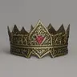
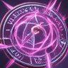

# Sorcerer Class Guide

The Sorcerer is a charisma-based spellcaster who draws on innate magic tied to their blood. Their power scales with Charisma, and they unlock affinity-specific abilities based on their character's chosen affinities (Lust, Chaos, or Heavenfire).

---

## Level Features

These are automatically granted at the listed level.

| Level | Icon | Feature |
|-------|------|---------|
| 1 |  | Font of Magic |
| 2 |  | Spell Sniper |
| 3 |  | Metamagic: Empowered |
| 5 |  | Spell Sniper Mastery |
| 7 |  | Arcane Deflection |
| 9 |  | Empowered Spells |
| 11 |  | Sorcerous Resilience |
| 14 |  | Extra Attack |
| 18 |  | Arcane Supremacy |
| 20 |  | Sorcerous Origin |

###  Font of Magic *(L1 — Ability, once per rest)*
Draw upon the magic in your blood to recover energy. Recovers **1d4 + Charisma modifier** energy to a randomly selected affinity pool (Lust, Chaos, or Heavenfire). Resets on rest.

###  Spell Sniper *(L2)*
Passive. Extends spell range and improves spell accuracy.

###  Metamagic: Empowered *(L3)*
Passive. Damage dice that roll 1 or 2 are automatically rerolled. Applies to all spell damage.

###  Spell Sniper Mastery *(L5)*
Passive. An upgraded form of Spell Sniper granting further range and accuracy bonuses.

###  Arcane Deflection *(L7)*
Passive. Grants **+2 to saving throws** against enemy spells.

###  Empowered Spells *(L9)*
Passive. Adds your **Charisma modifier** as a bonus to all spell damage rolls.

###  Sorcerous Resilience *(L11)*
Passive. Grants damage resistance based on your active affinities:
- **Lust** → Cold resistance
- **Chaos** → Radiation resistance
- **Heavenfire** → Heat resistance

###  Extra Attack *(L14)*
Passive. Grants one additional attack per turn.

###  Arcane Supremacy *(L18)*
Passive. Permanently increases **Charisma by 4**, with an ability score cap of 24.

###  Sorcerous Origin *(L20)*
Passive. Reduces all spell energy costs by **10%**.

---

## Spells (Level Options)

Spells are chosen on level up and added to your action list.

### Level 1
| Icon | Spell | Energy | Description |
|------|-------|--------|-------------|
|  | Firebolt | — | Standard fire damage spell. |
|  | Frost Breath | — | Cold damage cone attack. |

### Level 2
| Icon | Spell | Energy | Description |
|------|-------|--------|-------------|
|  | Chaos Bolt | 1 | Roll 2d8 + Charisma. The higher die sets the damage type. If both dice match, the bolt **leaps to a second enemy**. |

### Level 3
| Icon | Spell | Energy | Description |
|------|-------|--------|-------------|
|  | Command | — | A spell that issues a magical command to an enemy. |

### Level 5
| Icon | Spell | Energy | Description |
|------|-------|--------|-------------|
|  | Fireball | — | Large area fire damage. |
|  | Web Barrage | — | Ensnares enemies. |
|  | Chain Lightning | 5 | Arcs to all enemies. Primary target takes **10d6** electric damage; others take **5d6**. Dexterity save for half. |

---

## Affinity Infusions *(L6+ — Affinity-Gated)*

Unlocked at level 6 if your character has the matching affinity.

### Heavenfire Affinity
| Icon | Feature | Description |
|------|---------|-------------|
|  | Sorcerous Radiance | Your spells carry divine light. Deals an extra **1d6 radiation damage** per spell hit (upgrades to **2d6** at level 14+). |

### Lust Affinity
| Icon | Feature | Description |
|------|---------|-------------|
|  | Sorcerous Charm | Your spells carry seductive power. Spell hits have a chance to inflict **Horny** on targets (Wisdom save to resist). |

### Chaos Affinity
| Icon | Feature | Description |
|------|---------|-------------|
|  | Sorcerous Wild Magic | Chaos surges through your spells. After casting, **25% chance** for a random bonus effect: extra damage, self-heal, or enemy debuff. |

---

## Affinity Mastery *(L14+ — Affinity-Gated)*

Upgraded affinity abilities, also chosen as level options at level 14+.

### Heavenfire Affinity
| Icon | Feature | Description |
|------|---------|-------------|
|  | Sorcerous Divine Conduit | Spells that deal damage **heal you for 25%** of damage dealt. |

### Lust Affinity
| Icon | Feature | Description |
|------|---------|-------------|
|  | Sorcerous Enthrall | Spell targets must make a **Wisdom save or be Stunned** for 1 turn. |

### Chaos Affinity
| Icon | Feature | Description |
|------|---------|-------------|
|  | Sorcerous Wild Surge | After casting, **50% chance** for a powerful random bonus effect (upgraded from Wild Magic's 25%). |

---

## Feat Levels

Generic feats are available at levels **4, 8, 12, and 16**.

---

## Tips

- **Charisma is everything.** Attack rolls, damage bonuses (L9), and energy recovery (Font of Magic) all scale with Charisma. Stack it.
- **Font of Magic** is your energy lifeline in long fights — use it early if you need spell resources.
- **Chaos Bolt** is deceptively strong: the random damage type can bypass resistances, and matching dice trigger a free bounce for double the damage.
- **Chain Lightning** (L5) is your best multi-enemy nuke at 5 energy — save it for grouped enemies.
- **Affinity choices matter.** Pick your affinity infusion (L6) and mastery (L14) based on your playstyle: Heavenfire for sustained damage/lifesteal, Lust for crowd control, Chaos for high-variance burst.
- **Metamagic: Empowered** (L3) quietly improves every spell you cast for the rest of the game — its reroll effect prevents wasted low dice rolls.
